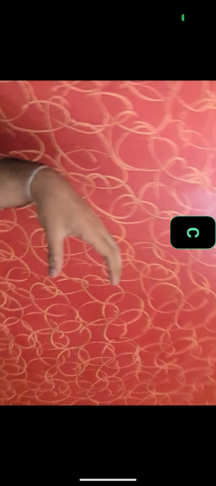
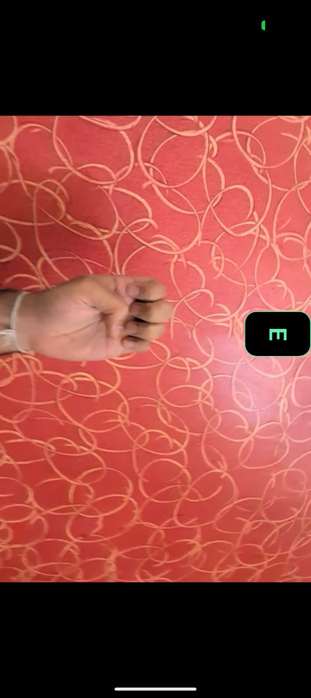
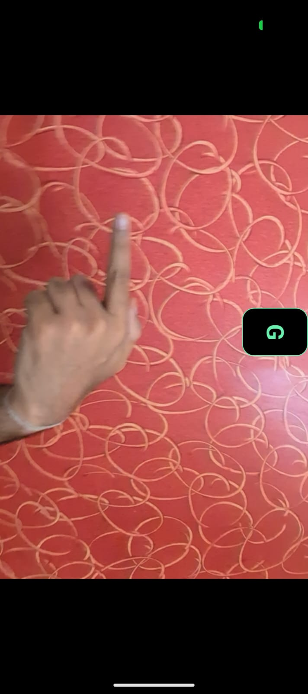
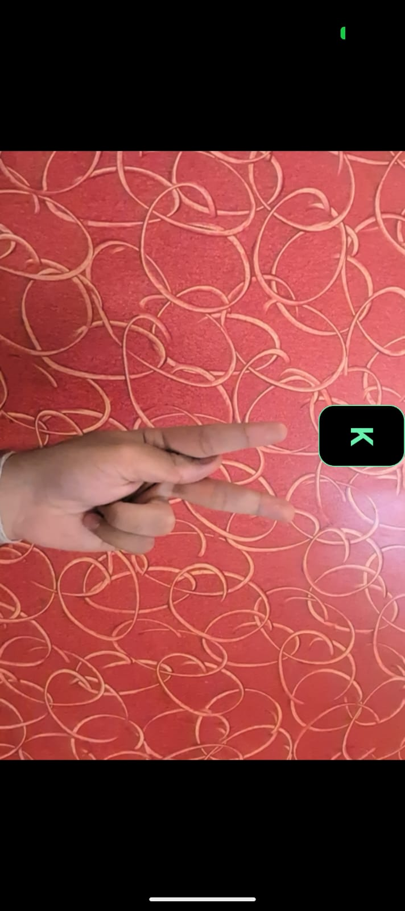

# Sign Bridge
Sign Bridge is an end-to-end Machine Learning pipeline and mobile application designed to bridge the communication gap by translating hand signs into digital text in real time.

The project uses **Python**, **OpenCV**, and **MediaPipe** for data collection, **TensorFlow/Keras** to train a lightweight Feed-Forward Neural Network, and **Flutter** with **TFLite** for real-time edge deployment on mobile devices.

---

## Features
* **Real-time Data Collector:** Interactive OpenCV script to harvest thousands of hand landmark coordinate samples per sign.
* **Mirrored Coordinate Normalization:** Flips left-hand coordinates dynamically during collection so the model trains on a uniform representation.
* **On-Device Machine Learning:** Optimized TFLite model running under 100ms latency on mobile GPUs.
* **Flutter Integration:** Pure native camera stream processing via `hand_landmarker` and `tflite_flutter`.

---

## Supported Signs & Visuals

The model is currently trained to recognize 10 distinct alphabets (`A`, `B`, `C`, `D`, `E`, `F`, `G`, `H`, `I`, `K`). Below are the references for some of the gestures:

| **C** | **E** | **G** | **H** | **K** |
|:---:|:---:|:---:|:---:|:---:|
|  |  |  |  |  |

---

## Architecture & Pipeline

### 1. Data Collection (`data_collector.py`)
Tracks 21 3D hand landmarks (X, Y, Z) using MediaPipe, generating 63 distinct spatial features per frame. It structures this data into `hand_data.csv` prefixed by the corresponding target character label.
* Run data collection script:
  ```bash
  python data_collector.py
  ```
* Hold the keyboard key to capture frames for that character.

### 2. Model Training (`train_model.py`)
Trains a Deep Neural Network (DNN) with Keras.
* Architecture:
    - Input layer (63 units)
    - Dense (128 units, ReLU) -> Dropout (0.2)
    - Dense (64 units, ReLU) -> Dropout (0.2)
    - Dense (32 units, ReLU)
    - Softmax Output layer (10 classification classes)
* Includes an EarlyStopping callback monitoring val_loss (patience=5) to avoid overfitting.
* Converts the trained model directly to a compact model.tflite flatbuffer.

### 3. Flutter Deployment
The compiled model.tflite is dropped directly into Flutter assets. Using the camera stream integration, the app feeds the native GPU MediaPipe landmarker coordinates right into the classification engine.

---